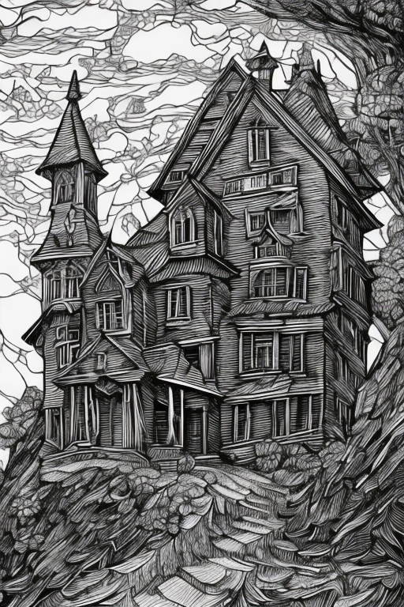
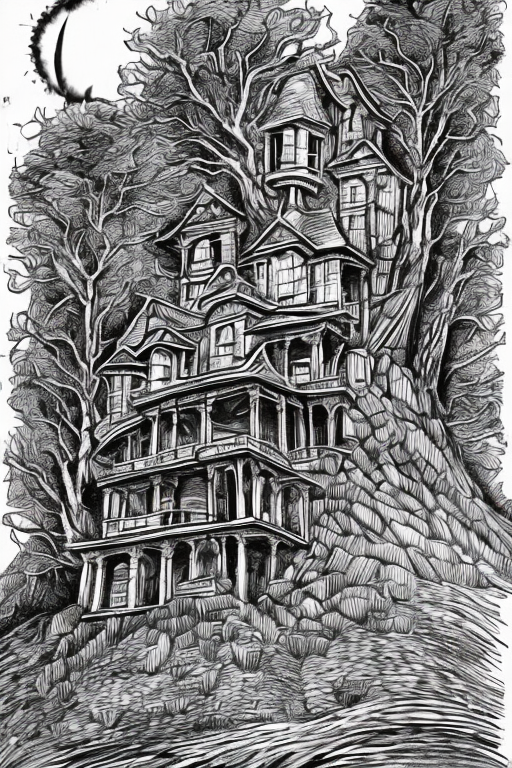
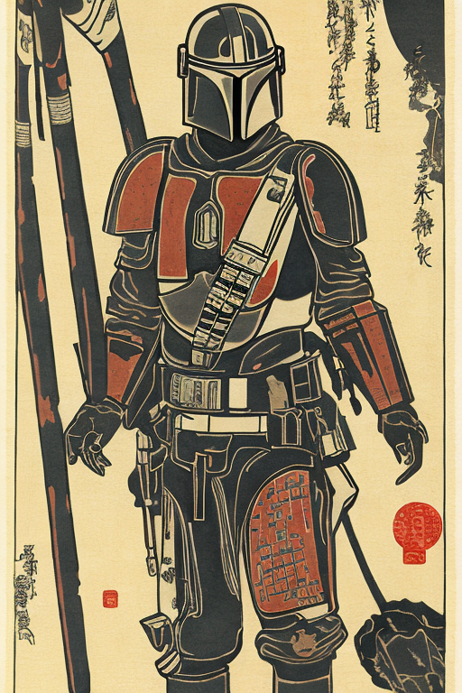

# Playing with Lexica-Art prompts  
Just playin'

  
 

**prompt**: Vintage 90's anime style. a lonely astronaut walking down the street; by Hajime Sorayama, Greg Tocchini, Virgil Finlay, sci-fi. line art. Environmental arcade art."  

  

  
  
  

**prompt**: black and white art deco style ink drawing of detailed the huge haunted house on the edge of a hill , highly detailed, fantasy art, in the style of greg rutkowski, epic, fantasy, intricate, hyper detailed, artstation, concept art, smooth, sharp focus, ray tracing  

  
  
  
  
  
  

**prompt**: "Ukiyo-e, woodblock print, mandalorian, full body image, wide angle photo, war propaganda, old timey, world war photo, world war, vintage poster, propaganda art, geo2099 style"  

  
  

